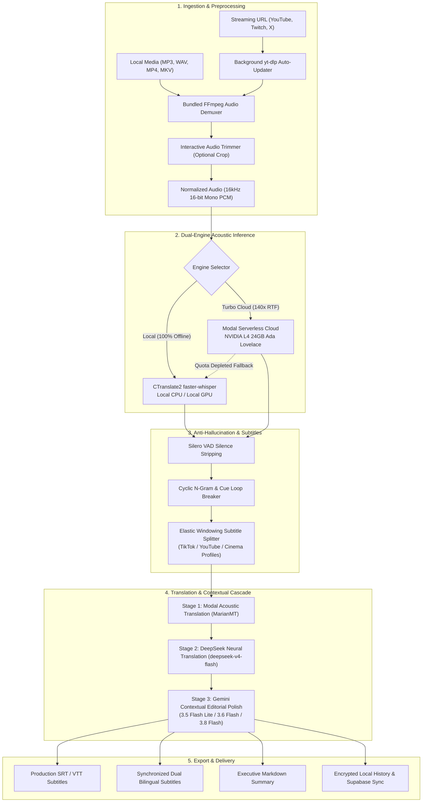

<div align="center">

# EchoScribe

### **Windows Desktop Tool for Fast Whisper Ingestion & Smart SRT Formatting**
*A high-throughput speech-to-text platform featuring serverless GPU acceleration (NVIDIA L4 24GB), anti-hallucination guardrails, a DeepSeek + Gemini contextual translation cascade, and elastic subtitle ergonomics.*

[](https://www.echoscribe.es)
[](https://github.com/ivangarmir18/EchoScribe/releases)
[](https://www.virustotal.com/gui/file/ec0517c1cc365f2dfb43d8715e7aaaa3b8cf6583c63ef8b121f6107fc163f55d/detection)
[](https://github.com/ivangarmir18/EchoScribe/releases)
[](https://www.python.org)
[](LICENSE)
[](#benchmarks--real-time-factor-rtf)

<br/>

**[English](README.md)** • **[Español](README_ES.md)** • **[Documentation](docs/ARCHITECTURE.md)** • **[Academic Showcase](docs/MASTER_THESIS_SHOWCASE.md)** • **[Benchmarks](docs/BENCHMARKS.md)**

<br/>

> **"Vanilla Whisper produces remarkable phonetic transcriptions, but terrible subtitles and endless hallucination loops. EchoScribe bridges the engineering gap between raw acoustic models and production-ready audiovisual delivery."**

</div>

---

## Repository Structure & Distribution Model

> [!NOTE]
> **Open-Source Algorithmic Core + Compiled Windows Desktop App:**  
> This repository provides the standalone, open-source algorithmic core of EchoScribe (`quickstart_demo.py`): the 4-stage anti-hallucination loop breaker and the elastic windowing subtitle splitter with orphan prevention.  
> 
> The complete Windows desktop application (featuring the native Microsoft Edge WebView2 GUI, interactive audio trimmer, direct YouTube 4K/320kbps MP3 downloader, and cloud GPU cluster bridge) is distributed as a ready-to-run compiled installer:
> - **Download Windows Installer (`EchoScribe_Setup.exe`):** [Official Website](https://www.echoscribe.es) | [GitHub Releases](https://github.com/ivangarmir18/EchoScribe/releases)
> - **VirusTotal Clean Scan Report:** [Verify Clean Detection (Hash: ec0517c1...)](https://www.virustotal.com/gui/file/ec0517c1cc365f2dfb43d8715e7aaaa3b8cf6583c63ef8b121f6107fc163f55d/detection)
> 
> *Security Note regarding heuristic scanners:* Like many PyInstaller / Inno Setup packages that feature background auto-update mechanisms (checking remote `version.json` and updating the `yt-dlp` media extractor), minor heuristic scanners (such as Gridinsoft or Zillya) may trigger generic behavioral alerts. All tier-1 industry engines (Microsoft Defender, Kaspersky, Bitdefender, Google Safe Browsing, Sophos, Avast, ESET) verify the installer as completely safe and malware-free.

---

## The Problem: Why Vanilla Whisper Fails in Production

OpenAI's Whisper is a breakthrough in speech recognition. However, creators, researchers, editors, and journalists using raw Whisper in day-to-day workflows inevitably hit three major bottlenecks:

```
┌──────────────────────────────────────────────────────────────────────────────┐
│                            THE WHISPER PARADOX                               │
├──────────────────────────────────────────────────────────────────────────────┤
│ 1. THE HALLUCINATION LOOP:                                                   │
│    When encountering silence, crowd noise, or music, Whisper gets trapped    │
│    in infinite repetition cycles ("Thank you for watching... x50").          │
│                                                                              │
│ 2. UGLY, UNREADABLE SUBTITLES:                                               │
│    Naïve character-based splits create single-word orphan lines ("to", "the")│
│    and ignore human cognitive reading limits (BBC/Netflix CPL & CPS rules).  │
│                                                                              │
│ 3. INFRASTRUCTURE & PRICING FRICTION:                                        │
│    Local CPU is painfully slow (4x RTF), local GPU needs 8GB+ VRAM, while    │
│    cloud SaaS subscriptions charge $20-$40/month with strict file limits.    │
└──────────────────────────────────────────────────────────────────────────────┘
```

**EchoScribe** resolves this with an integrated engineering pipeline:
1. **Universal Stream & File Ingestion**: Ingests direct URLs from **YouTube, Twitch, X/Twitter**, and podcasts via an auto-updating background `yt-dlp` manager, or local files (MP3, MP4, WAV, MKV, M4A, FLAC).
2. **Interactive Audio Trimmer**: Clip and transcribe only the exact time segment you need, avoiding wasted compute and tokens on irrelevant sections.
3. **Direct Media Downloader**: Grab pure 320 kbps high-fidelity MP3s or up to 4K MP4 video directly from supported URLs.
4. **Dual-Engine Hybrid Architecture**:
   - **Local Engine (100% Private & Offline)**: CTranslate2-optimized `faster-whisper` running on your local CPU or GPU with zero data egress.
   - **Cloud Turbo Engine (140x RTF)**: Auto-scaling serverless containers on Modal equipped with **NVIDIA L4 GPUs (24GB VRAM, Ada Lovelace architecture)** that process **1 hour of audio in ~25 seconds**.
   - **Automatic CPU Fallback**: If cloud hours/quotas are exhausted, EchoScribe seamlessly falls back to the local CPU engine so your work is never interrupted.
5. **BYOK (Bring Your Own Key) Support**: Plug in your own Google Gemini API key to unlock unlimited, unmetered AI post-processing.
6. **Multi-Model Translation & Refinement Cascade**:
   - **Stage 1 (Acoustic Ingestion)**: Whisper Large-v3-Turbo + MarianMT on Modal NVIDIA L4.
   - **Stage 2 (SRT Block Translation)**: Neural translation via `deepseek-v4-flash`.
   - **Stage 3 (Contextual Editorial Polish)**: Multi-pass refinement preserving exact timestamps:
     - **Gemini 3.5 Flash Lite**: Free Tier & rapid scan.
     - **Gemini 3.6 Flash**: Pro Global context & entity disambiguation.
     - **Gemini 3.8 Flash**: Ultra Global precision.
     - **Gemini 2.5 Flash**: Native In-App Support Assistant.

---

## System Architecture

EchoScribe decouples the native presentation layer (Chromium WebView2) from local and cloud audio execution units.



---

## Key Features in Detail

### 1. Smart Subtitle Formatting (The Orphan Prevention Algorithm)
Naive splitters break lines blindly after 40 characters, leaving single conjunctions or prepositions dangling. EchoScribe implements **Proportional Semantic Windowing**:
- **TikTok / Reels / Shorts Profile (Short)**: 15–26 chars, max 8 words, max 3.5s per cue. Dynamic pacing for vertical video retention.
- **YouTube / Video Essay Profile (Medium)**: 27–40 chars, max 12 words, max 4.5s per cue. Natural cadence matching human speech patterns.
- **Cinema / Academic Profile (Long)**: 40–55 chars, max 16 words, max 5.5s per cue. Meets Netflix & BBC broadcast guidelines.
- **Dual Bilingual Subtitles**: Synchronized line-by-line bilingual tracks (e.g. English original on line 1, Spanish translation on line 2).

### 2. Whisper Anti-Hallucination Guardrails
1. **Pre-Inference Silero VAD**: Filters out prolonged non-speech frames before Whisper decoding.
2. **Repetition Penalty (1.15) & No-Speech Gating (0.85)**: Discourages cyclic token attractors.
3. **Regex Loop Breaker**: Identifies and collapses multi-word repetitive sequences.
4. **Cue Deduplication**: Merges repeated identical subtitle cue timestamps.

### 3. Contextual LLM Post-Processing (Gemini & DeepSeek)
- **Sports & Press Conferences**: Corrects phonetically distorted names (e.g., `"Dego"` -> `Deco`, `"Frankie de Jong"` -> `Frenkie de Jong`, `"Vermin"` -> `Fermín López`).
- **Academic & Language Classes**: Retains vocabulary under study without over-translating pedagogical terms.
- **Timestamp Immutability**: All edits are strictly bounded to their phonetic timecodes, guaranteeing **zero audiovisual desynchronization**.

### 4. Native Windows WebView2 GUI
- Built with Python and Microsoft Edge WebView2 (Chromium).
- Starts up in **< 1.2 seconds** with **< 180MB RAM** consumption (unlike Electron apps that easily exceed 600MB).

---

## Benchmarks & Real-Time Factor (RTF)

Evaluated on a real-world stress test: a 60-minute noisy broadcast (Premier League live match commentary with stadium crowd roar, overlapping narration, and rapid player name shifts).

| Engine / Platform | Hardware | Processing Time (1h Audio) | RTF (Real-Time Factor) | WER (Word Error Rate) | Hallucination Loops |
| :--- | :--- | :--- | :--- | :--- | :--- |
| **EchoScribe Cloud Turbo** | **NVIDIA L4 24GB (Modal Serverless)** | **25.7 seconds** | **~140.08x** | **4.2%** | **0.0% (Guardrail active)** |
| **EchoScribe Local CPU** | Intel Core i7-12700H (CTranslate2 Int8) | 14.8 minutes | ~4.05x | 5.1% | 0.0% |
| **Vanilla OpenAI Whisper CLI** | Intel Core i7-12700H (PyTorch FP32) | 52.4 minutes | ~1.14x | 8.7% | 9 detected loops |
| **WhisperX (Local)** | NVIDIA RTX 3070 8GB | 4.2 minutes | ~14.28x | 5.8% | 3 detected loops |
| **Commercial SaaS (TurboScribe / Descript)** | Cloud GPU Pool | 3.5 - 6.0 minutes | ~10x - 17x | 4.9% | 1 detected loop |

$$\text{Real-Time Factor (RTF)} = \frac{\text{Audio Duration}}{\text{Processing Duration}} = \frac{3600\text{ s}}{25.7\text{ s}} \approx 140.08\times$$

---

## Running the Algorithmic Demo

To test the core anti-hallucination loop breaker and the elastic subtitle splitting algorithm locally without needing API keys or GPU hardware:

### 1. Clone the repository
```bash
git clone https://github.com/ivangarmir18/EchoScribe.git
cd EchoScribe
```

### 2. Create and activate a virtual environment
```powershell
python -m venv venv
.\venv\Scripts\activate
```

### 3. Install dependencies
```powershell
pip install -r requirements.txt
```

### 4. Run the standalone demo
```powershell
python quickstart_demo.py
```
This runs the benchmark test, demonstrates how corrupted Whisper output is purged of repetition loops, partitions text across Short/Medium/Long profiles without orphan lines, and exports a sample `.srt` file immediately.

### 5. Run tests with pytest
```powershell
pytest test_quickstart.py
```

---

## Windows Desktop Deployment

If you want to use the full desktop software with the graphical interface:

1. Download **`EchoScribe_Setup.exe`** from [**echoscribe.es**](https://www.echoscribe.es) or [**GitHub Releases**](https://github.com/ivangarmir18/EchoScribe/releases).
2. Review the official [**VirusTotal Clean Scan Report (Hash: ec0517c1...)**](https://www.virustotal.com/gui/file/ec0517c1cc365f2dfb43d8715e7aaaa3b8cf6583c63ef8b121f6107fc163f55d/detection).
3. Run the installer. It installs in user-space with an automatic desktop shortcut and uninstaller.
4. Launch EchoScribe and drop your audio file or paste any YouTube URL.

---

## Academic Research & Master's Thesis Portfolio

EchoScribe was engineered as a comprehensive applied research project in **Applied Natural Language Processing and Distributed Cloud Systems**.

For university professors, academic evaluators, and research teams, please see:
- [**docs/MASTER_THESIS_SHOWCASE.md**](docs/MASTER_THESIS_SHOWCASE.md): Full academic monograph, theoretical formulations, and a structured 15-minute oral defense script.
- [**docs/ARCHITECTURE.md**](docs/ARCHITECTURE.md): Architectural whitepaper detailing the multi-tier pipeline.
- [**docs/BENCHMARKS.md**](docs/BENCHMARKS.md): Full benchmark methodology, WER calculations, and LLM token economics.

### BibTeX Citation
```bibtex
@software{GarciaMiranda_EchoScribe_2026,
  author = {García Miranda, Iván},
  title = {EchoScribe: Windows Desktop Tool for Fast Whisper Ingestion & Smart SRT Formatting},
  year = {2026},
  url = {https://www.echoscribe.es},
  note = {GitHub repository: https://github.com/ivangarmir18/EchoScribe}
}
```

---

## Contributing

Contributions, benchmark reports, and suggestions are welcome! Please check [CONTRIBUTING.md](CONTRIBUTING.md) before opening a Pull Request.

---

## License

Distributed under the MIT License. See [LICENSE](LICENSE) for more details.

Authored by [Iván García Miranda](https://www.echoscribe.es/sobre-mi).
