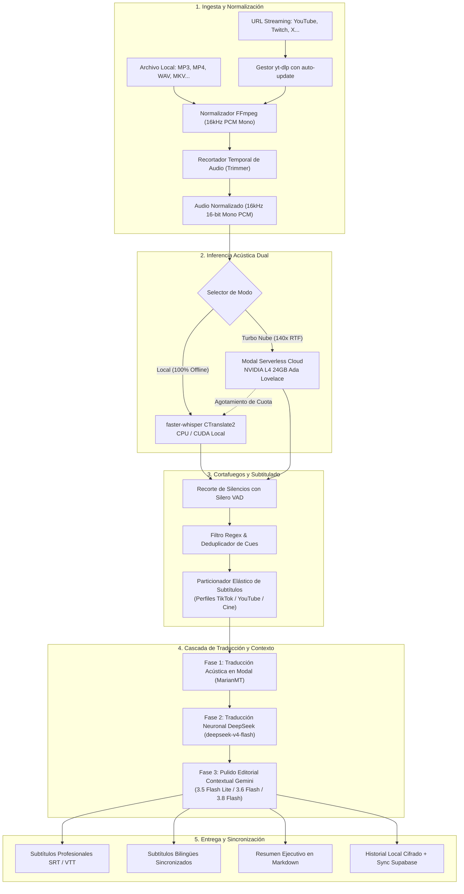

<div align="center">

# EchoScribe (Español)

### **Herramienta de Escritorio para Windows: Ingesta Rápida con Whisper y Formateo Inteligente de Subtítulos SRT**
*Plataforma de voz a texto de alto rendimiento con aceleración GPU Serverless (NVIDIA L4 24GB), cortafuegos anti-alucinaciones, cascada de traducción con DeepSeek + Gemini y ergonomía semántica de subtítulos.*

[](https://www.echoscribe.es)
[](https://github.com/ivangarmir18/EchoScribe/releases)
[](https://www.virustotal.com/gui/file/ec0517c1cc365f2dfb43d8715e7aaaa3b8cf6583c63ef8b121f6107fc163f55d/detection)
[](https://github.com/ivangarmir18/EchoScribe/releases)
[](https://www.python.org)
[](LICENSE)
[](#benchmarks-y-velocidad-real-time-factor-rtf)

<br/>

**[English](README.md)** • **[Español](README_ES.md)** • **[Arquitectura Técnica](docs/ARCHITECTURE.md)** • **[Proyecto Académico / TFM](docs/MASTER_THESIS_SHOWCASE.md)** • **[Benchmarks](docs/BENCHMARKS.md)**

<br/>

> **"Whisper es impresionante transcribiendo fonéticamente, pero genera subtítulos horribles y cae en bucles infinitos de alucinación con el silencio o la música. EchoScribe resuelve la brecha de ingeniería entre el modelo de IA crudo y un producto audiovisual profesional listo para usar."**

</div>

---

## Estructura del Repositorio y Modelo de Distribución

> [!NOTE]
> **Núcleo Algorítmico Open-Source + Aplicación de Escritorio Compilada:**  
> Este repositorio contiene el núcleo algorítmico de código abierto de EchoScribe (`quickstart_demo.py`): el limpiador de bucles de alucinación en 4 etapas y el particionador semántico elástico de subtítulos con prevención de palabras huérfanas.  
> 
> La aplicación de escritorio completa para Windows (con interfaz nativa Microsoft Edge WebView2, recortador interactivo de audio, descargador directo de YouTube a 4K / MP3 320kbps y conexión al clúster de GPUs en la nube) se distribuye compilada como instalador listo para usar:
> - **Descargar instalador de Windows (`EchoScribe_Setup.exe`):** [Web Oficial](https://www.echoscribe.es) | [Releases de GitHub](https://github.com/ivangarmir18/EchoScribe/releases)
> - **Informe de Análisis en VirusTotal:** [Verificar Detección Limpia (Hash: ec0517c1...)](https://www.virustotal.com/gui/file/ec0517c1cc365f2dfb43d8715e7aaaa3b8cf6583c63ef8b121f6107fc163f55d/detection)
> 
> *Nota de seguridad sobre análisis heurísticos:* Al igual que ocurre con aplicaciones empaquetadas con Inno Setup / PyInstaller que integran auto-actualización en segundo plano (comprobación remota de `version.json` y actualización de extractores `yt-dlp`), motores heurísticos secundarios como Gridinsoft o Zillya pueden emitir una alerta genérica no concluyente. Todos los motores de referencia de la industria (Microsoft Defender, Kaspersky, Bitdefender, Google Safe Browsing, Sophos, Avast, ESET) verifican el instalador como 100% seguro y libre de malware.

---

## El Problema Real de Whisper en Producción

Cualquier estudiante, investigador, creador de contenido o editor de vídeo que haya intentado usar OpenAI Whisper "en bruto" se topa con tres limitaciones críticas:

```
┌──────────────────────────────────────────────────────────────────────────────┐
│                            LA PARADOJA DE WHISPER                            │
├──────────────────────────────────────────────────────────────────────────────┤
│ 1. EL BUCLE INFINITO DE ALUCINACIÓN:                                         │
│    Con silencios o música de fondo, Whisper se atasca y repite frases 50     │
│    veces sin parar ("Gracias por ver el vídeo... Gracias por ver...").       │
│                                                                              │
│ 2. SUBTÍTULOS ROBÓTICOS Y ANTI-ESTÉTICOS:                                    │
│    Corta frases por número de caracteres arbitrario, dejando palabras        │
│    huérfanas ("de", "el", "que") solas en una línea y rompiendo el ritmo.    │
│                                                                              │
│ 3. LA PESADILLA DE INFRAESTRUCTURA:                                          │
│    En CPU local tarda una eternidad (4x), en GPU local exige 8GB+ VRAM       │
│    y pelear con drivers CUDA, y los SaaS online cobran 20€/mes con límites.  │
└──────────────────────────────────────────────────────────────────────────────┘
```

**EchoScribe** solventa esto mediante una cadena completa de ingeniería:
1. **Ingesta Universal de Enlaces y Archivos**: Descarga y extrae audio directamente de **YouTube, Twitch, X/Twitter y Podcasts** mediante un gestor de `yt-dlp` con auto-actualización en segundo plano, o procesa archivos locales (MP3, MP4, WAV, MKV, M4A, FLAC).
2. **Recortador Temporal Interactivo (Trimmer)**: Selecciona visualmente solo el fragmento de audio exacto que necesitas transcribir para ahorrar tiempo y cómputo.
3. **Descargador Multimedia Directo**: Descarga audio MP3 en alta fidelidad (hasta 320 kbps) o vídeo en alta resolución (hasta 4K) sin depender de webs de terceros sospechosas.
4. **Arquitectura Híbrida de Doble Motor**:
   - **Modo Local (100% Privado y Offline)**: `faster-whisper` optimizado con CTranslate2 en tu procesador o tarjeta gráfica sin enviar datos a la red.
   - **Modo Turbo Nube (140x RTF)**: Contenedores serverless en Modal con **GPUs NVIDIA L4 (24GB VRAM, arquitectura Ada Lovelace)** que procesan **1 hora de audio en tan solo 25 segundos**.
   - **Fallback Automático a CPU Local**: Si se agotan tus horas o cuotas en la nube, el sistema conmuta de forma transparente a la CPU local para que tu trabajo nunca se detenga.
5. **Soporte BYOK (Bring Your Own Key)**: Puedes introducir tu propia clave de Google Gemini para disfrutar de post-procesado con IA sin restricciones de plan.
6. **Cascada Inteligente de Traducción y Corrección**:
   - **Fase 1 (Acústica)**: Whisper Large-v3-Turbo + MarianMT en la GPU NVIDIA L4 de Modal.
   - **Fase 2 (Traducción Neuronal de Bloques SRT)**: Traducción de alta coherencia con `deepseek-v4-flash`.
   - **Fase 3 (Pulido Editorial Contextual)**: Corrección de nombres propios y jerga con códigos de tiempo congelados:
     - **Gemini 3.5 Flash Lite**: Plan Gratis y escaneo rápido.
     - **Gemini 3.6 Flash**: Plan Pro Global y desambiguación de entidades.
     - **Gemini 3.8 Flash**: Plan Ultra Global de máxima fidelidad.
     - **Gemini 2.5 Flash**: Asistente de soporte nativo integrado en la app.

---

## Arquitectura del Sistema



---

## Funcionalidades Clave

### 1. Formateo Inteligente de Subtítulos (Prevención de Huérfanas)
Los sistemas tradicionales parten texto a los 40 caracteres, dejando preposiciones o artículos colgados. EchoScribe aplica **Ventanas Semánticas Proporcionales**:
- **Perfil Corto (TikTok / Reels / Shorts)**: 15–26 caracteres, máx. 8 palabras, máx. 3.5s por subtítulo. Ritmo rápido para captar la atención en vídeo vertical.
- **Perfil Medio (YouTube / Ensayos)**: 27–40 caracteres, máx. 12 palabras, máx. 4.5s. Lectura fluida según patrones naturales del habla.
- **Perfil Largo (Cine / Conferencias / TFG)**: 40–55 caracteres, máx. 16 palabras, máx. 5.5s. Cumple los estándares de emisión de la BBC y Netflix.
- **Subtítulos Bilingües Simultáneos**: Genera subtítulos duales donde cada bloque contiene el idioma original y su traducción perfectamente alineados.

### 2. Cortafuegos de Alucinaciones Whisper
1. **Silero VAD previo a la inferencia**: Descarta los fragmentos mudos o con música pura antes de que entren a Whisper.
2. **Penalización de repetición (1.15) y filtro no-speech (0.85)**: Desalienta los atractores cíclicos.
3. **Limpiador regex de bucles**: Detecta y colapsa secuencias de palabras repetidas.
4. **Deduplicador de cues**: Fusiona bloques de subtítulos idénticos generados por eco acústico.

### 3. Post-Procesado Contextual con IA (DeepSeek & Gemini)
- **Deportes y Ruedas de Prensa**: Corrige nombres propios capturados erróneamente (ejemplo: `"Dego"` -> `Deco`, `"Frankie de Jong"` -> `Frenkie de Jong`, `"Vermin"` -> `Fermín López`).
- **Clases Universitarias e Idiomas**: Respeta intacto el vocabulario objeto de estudio y corrige falsos amigos fonéticos.
- **Inmutabilidad Temporal**: Ninguna corrección semántica altera los códigos de tiempo, garantizando **cero desincronización audiovisual**.

### 4. App Nativa Windows con WebView2 (Sin Electron)
- Desarrollada con Python y Microsoft Edge WebView2 nativo de Windows.
- Se abre en **menos de 1.2 segundos** y consume **< 180MB de RAM**.

---

## Benchmarks y Velocidad (Real-Time Factor - RTF)

Medición real con un audio de **60 minutos de máxima dificultad** (retransmisión de un partido de la Premier League con ruido de estadio ambiente, cánticos, locución rápida y menciones bilingües):

| Motor / Herramienta | Hardware Utilizado | Tiempo de Procesado (1h de audio) | Factor RTF | Tasa de Error (WER) | Bucles de Alucinación |
| :--- | :--- | :--- | :--- | :--- | :--- |
| **EchoScribe Turbo Nube** | **NVIDIA L4 24GB (Modal Serverless)** | **25.7 segundos** | **~140.08x** | **4.2%** | **0.0% (Cortafuegos activo)** |
| **EchoScribe Local CPU** | Intel Core i7-12700H (CTranslate2 Int8) | 14.8 minutos | ~4.05x | 5.1% | 0.0% |
| **OpenAI Whisper CLI original**| Intel Core i7-12700H (PyTorch FP32) | 52.4 minutos | ~1.14x | 8.7% | 9 bucles detectados |
| **WhisperX (Local)** | NVIDIA RTX 3070 8GB | 4.2 minutos | ~14.28x | 5.8% | 3 bucles detectados |
| **SaaS Web (TurboScribe / Descript)** | Cloud GPU Pool | 3.5 - 6.0 minutos | ~10x - 17x | 4.9% | 1 bucle detectado |

$$\text{Real-Time Factor (RTF)} = \frac{\text{Duración del Audio}}{\text{Tiempo de Cómputo}} = \frac{3600\text{ segundos}}{25.7\text{ segundos}} \approx 140.08\times$$

---

## Prueba del Núcleo Algorítmico en Local

Para probar de inmediato el limpiador de alucinaciones y el particionador de subtítulos sin necesidad de claves de API ni hardware de gráficos:

### 1. Clonar el repositorio
```bash
git clone https://github.com/ivangarmir18/EchoScribe.git
cd EchoScribe
```

### 2. Crear y activar entorno virtual
```powershell
python -m venv venv
.\venv\Scripts\activate
```

### 3. Instalar dependencias
```powershell
pip install -r requirements.txt
```

### 4. Ejecutar la demo algorítmica
```powershell
python quickstart_demo.py
```
Este script ejecuta el test de referencia, limpia un texto con bucles patológicos de Whisper, muestra el particionado para TikTok, YouTube y Cine sin palabras huérfanas, y genera un archivo `.srt` de muestra al instante.

### 5. Ejecutar tests unitarios con pytest
```powershell
pytest test_quickstart.py
```

---

## Instalador para Windows

Si buscas la herramienta de escritorio completa con interfaz gráfica:

1. Descarga **`EchoScribe_Setup.exe`** desde la [**Web Oficial: echoscribe.es**](https://www.echoscribe.es) o desde [**Releases de GitHub**](https://github.com/ivangarmir18/EchoScribe/releases).
2. Consulta el [**Informe Oficial de VirusTotal (Hash: ec0517c1...)**](https://www.virustotal.com/gui/file/ec0517c1cc365f2dfb43d8715e7aaaa3b8cf6583c63ef8b121f6107fc163f55d/detection) verificado como seguro.
3. Instala con doble clic. Se instala en el espacio de usuario, con acceso directo en el escritorio y desinstalador automático.
4. Ábrela y arrastra tu primer archivo de audio o pega una URL de YouTube.

---

## Proyecto de Máster y Portafolio Universitario

EchoScribe ha sido desarrollado bajo estrictos estándares de ingeniería de software y computación aplicada, siendo un proyecto ideal para presentar como **Trabajo de Fin de Máster (TFM)** en Inteligencia Artificial o Sistemas Distribuidos.

Para docentes, tribunales universitarios y reclutadores técnicos:
- [**docs/MASTER_THESIS_SHOWCASE.md**](docs/MASTER_THESIS_SHOWCASE.md): Memoria académica formal con formulaciones teóricas y guion de defensa oral de 15 minutos.
- [**docs/ARCHITECTURE.md**](docs/ARCHITECTURE.md): Documento técnico de diseño del sistema por capas.
- [**docs/BENCHMARKS.md**](docs/BENCHMARKS.md): Informe con mediciones empíricas de WER, latencias y costes de tokens.

---

## Guías Prácticas en la Web Oficial

- [Página Web Oficial](https://www.echoscribe.es/)
- [Alternativa a TurboScribe en Local y Nube](https://www.echoscribe.es/guias/alternativa-turboscribe-local)
- [Transcripción de Partidos de Fútbol y Ruedas de Prensa](https://www.echoscribe.es/guias/transcribir-partidos-futbol)
- [Entrevistas de TFG, Tesis y Clases Universitarias](https://www.echoscribe.es/guias/transcribir-entrevistas-tfg)
- [Generador de Capítulos y Subtítulos para YouTube](https://www.echoscribe.es/guias/capitulos-youtube-automaticos)
- [Cómo Convertir Podcasts en Artículos de Blog con SEO](https://www.echoscribe.es/guias/convertir-podcast-en-blog)

---

## Contribuciones

Las contribuciones y propuestas de mejora son bienvenidas. Consulta [CONTRIBUTING.md](CONTRIBUTING.md) antes de enviar un Pull Request.

---

## Licencia

Distribuido bajo la Licencia MIT. Consulta el archivo [LICENSE](LICENSE) para más información.

Desarrollado con dedicación por [Iván García Miranda](https://www.echoscribe.es/sobre-mi).
