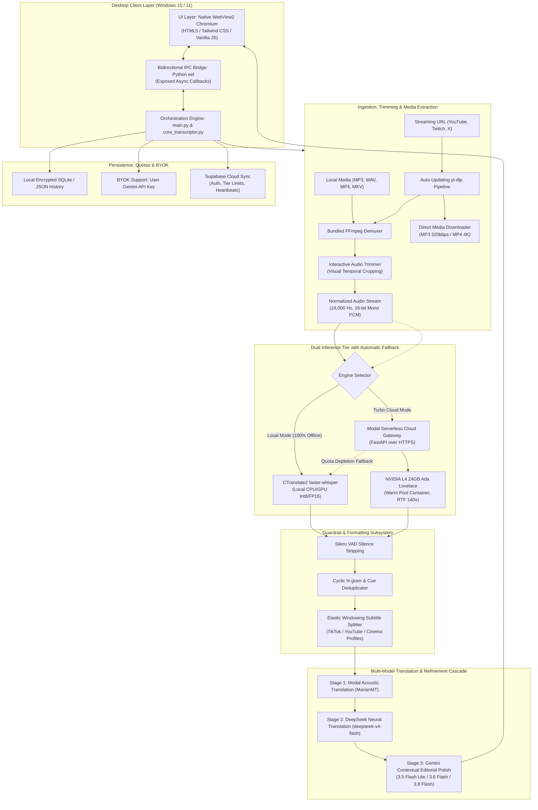

# EchoScribe Architecture & Technical Whitepaper

> **Document Version:** 1.3.2  
> **Author:** Iván García Miranda  
> **Hardware Target:** Serverless NVIDIA L4 (24GB VRAM, Ada Lovelace) & Windows 10/11 Native Edge WebView2  
> **Target Audience:** Systems Architects, Machine Learning Engineers, Academic Evaluators & Open-Source Contributors

---

## 1. Executive Technical Summary

EchoScribe is a high-throughput, cross-paradigm speech-to-text (STT) and subtitle generation platform engineered for Windows 10/11. Unlike conventional monolithic wrappers around OpenAI's Whisper, EchoScribe implements a **decoupled, multi-tier pipeline** designed to overcome the classical limitations of end-to-end neural acoustic models:

1. **Acoustic Drift & Hallucination Loops:** Solved via a four-tier pre/post-inference guardrail combining Silero Voice Activity Detection (VAD), token entropy gating, and cyclical n-gram regex collapse.
2. **Arbitrary Timestamp Chunking:** Solved via an **Elastic Windowing Dynamic Splitter with Orphan Prevention**, mapping phonetic timestamps into human-readable subtitle cues adhering to strict BBC and Netflix ergonomic guidelines.
3. **Hardware Latency vs Cloud Privacy Trade-off:** Solved through a **Hybrid Dual Engine**, allowing users to dynamically switch between an air-gapped local CTranslate2 runtime and an ephemeral serverless GPU cluster on Modal running **NVIDIA L4 GPUs (24GB VRAM)** achieving up to **140x Real-Time Factor (RTF)**, backed by an **automatic fallback to local CPU** when cloud quotas deplete.
4. **Interactive Ingestion & Media Extraction:** Features an interactive audio trimmer (temporal cropping) to process exact time intervals, and a direct media downloader grabbing pure 320 kbps MP3 audio or up to 4K MP4 video.
5. **Multi-Model Translation Cascade:** Features a 3-tier cascade leveraging Modal MarianMT, DeepSeek Neural Translation (`deepseek-v4-flash`), and tiered Google Gemini contextual intelligence (3.5 Flash Lite, 3.6 Flash, 3.8 Flash, and 2.5 Flash for the native assistant).

---

## 2. Global System Topology



---

## 3. Deep-Dive Component Breakdown

### 3.1. Ingestion, Audio Normalization & Direct Media Extraction
- **Streaming Ingestion & yt-dlp Auto-Updater:** Automatically checks upstream YouTube/Twitch extractor definitions in the background (`yt_dlp_manager.py`). 
- **Direct Media Downloader:** Beyond transcription, EchoScribe enables direct extraction of high-bitrate audio (pure MP3 up to 320 kbps) or video streams (up to 4K MP4) directly into local user storage.
- **Interactive Audio Trimmer (Temporal Cropping):** Allows users to visually define an audio sub-segment $[t_{\text{start}}, t_{\text{end}}]$, executing selective transcription without consuming processing quotas on irrelevant sections.
- **FFmpeg Stream Processing:** Bypasses external system dependencies with a bundled static binary, generating normalized single-channel 16 kHz 16-bit PCM:
  $$\text{Audio}_{\text{norm}} = \text{FFmpeg}\left(-i \text{ input } -vn -acodec\text{ pcm\_s16le} -ar\text{ 16000} -ac\text{ 1}\right)$$

---

### 3.2. Dual Acoustic Inference: Local vs Serverless Cloud

| Metric / Parameter | Local Engine (faster-whisper) | Cloud Turbo Engine (Modal Serverless) |
| :--- | :--- | :--- |
| **Runtime Backend** | CTranslate2 (C++ Inference Engine) | PyTorch + CUDA 12 on Debian Slim |
| **Quantization** | `int8` (CPU) / `float16` (NVIDIA CUDA) | `float16` native Ada Lovelace tensor cores |
| **Compute Target** | Host CPU / Dedicated GPU | **NVIDIA L4 (24GB VRAM, Ada Lovelace)** |
| **Real-Time Factor (RTF)** | $4.05\times$ (CPU) / $15\times$ (GPU) | **$140.08\times$** (Serverless Turbo) |
| **Network Footprint** | $0\text{ bytes}$ (Air-gapped capable) | Encrypted HTTPS (Audio payload) |
| **Failover Mechanism** | Primary offline execution | **Automatic fallback to local CPU** upon quota depletion |

#### Modal Serverless Cloud Architecture (`modal_app.py`)
To achieve a **140x RTF** (processing a 60-minute audio file in ~25.7 seconds):
- **Serverless Class Definition:** Evaluated with `@app.cls(gpu="L4", image=image, scaledown_window=5, timeout=3600)`.
- **Pre-cached Weights:** HuggingFace weights for `deepdml/faster-whisper-large-v3-turbo-ct2` and 19 MarianMT translation language pairs are baked directly into the container image layer, eliminating cold-start latency.
- **Warm Pool Lifecycle:** Containers remain warm for subsequent batch requests, dropping consecutive request overhead to near zero.

---

### 3.3. Algorithmic Guardrails Against Whisper Hallucination Loops

Autoregressive models like Whisper predict future tokens based on prior token history:
$$P(W_t \mid W_{<t}, A)$$
When the acoustic signal $A$ drops into sustained silence, ambient stadium noise, or repetitive musical loops, the acoustic conditioning collapses and the language prior creates **pathological repetition cascades**.

EchoScribe combats this at four distinct layers:

```
[Audio Input]
      │
      ▼
1. Silero VAD (Voice Activity Detection) ──> Drops silent/music frames before inference
      │
      ▼
2. Beam Search Repetition Penalty (1.15) ──> Modifies logits to discourage token recurrence
      │
      ▼
3. Logprob (-1.5) & No-Speech (0.85) Gating ──> Discards hallucinations during decoding
      │
      ▼
4. Regex & Cue Deduplication (Post-Filter) ──> Collapses cyclical n-grams:
      │                                         - Identifies identical text cues
      │                                         - Strips repetitive sub-phrases
      ▼
[Clean Phonetic Cues]
```

---

### 3.4. Semantic Subtitle Ergonomics (The Orphan Prevention Algorithm)

EchoScribe's **Proportional Semantic Windowing** enforces strict cognitive reading comfort limits across three target profiles:

| Profile | Target Medium | Min Chars | Max Chars | Max Words | Min Words | Max Duration |
| :--- | :--- | :--- | :--- | :--- | :--- | :--- |
| **Corto** | TikTok, Instagram Reels, Shorts | 15 | 26 | 8 | 2 | 3.5 sec |
| **Medio** | YouTube, Video Essays, Podcasts | 27 | 40 | 12 | 3 | 4.5 sec |
| **Largo** | Cinema, University Lectures, TFG | 40 | 55 | 16 | 4 | 5.5 sec |

#### Algorithmic Invariants:
1. **Orphan Prevention Rule:** If a trailing split contains fewer than `min_words`, the splitter executes a backward merge candidate check with the preceding cue.
2. **Elastic Boundary Budget:** If backward merging exceeds `max_chars`, the boundary is allowed an elasticity buffer of $+20\%$ to $+30\%$ before forcing a split, preventing isolated conjunctions or broken phrases.
3. **Proportional Timestamp Interpolation:** Word duration is distributed proportionally to word character length across the segment:
   $$t_{\text{word}} = t_{\text{start}} + \sum_{k=1}^{n} \left( \frac{\text{len}(w_k)}{\sum \text{len}(w)} \right) \cdot \Delta t$$

---

### 3.5. Multi-Model Translation Cascade & Gemini Tier Distribution

EchoScribe features a coordinated multi-model pipeline for multilingual processing:

```
[Raw Audio Ingestion]
        │
        ▼
[Stage 1: Modal Acoustic Translation (MarianMT)]
Fast on-GPU translation for European language pairs
        │
        ▼
[Stage 2: DeepSeek Neural Translation (deepseek-v4-flash)]
High-fidelity contextual SRT block translation ($0.44/1M in, $1.32/1M out)
        │
        ▼
[Stage 3: Gemini Contextual Editorial Polish]
Entity correction, jargon preservation, and zero-drift timestamp locking
```

#### Gemini Model Distribution by Application Tier:
- **Gemini 3.5 Flash Lite (`gemini-3.5-flash-lite`):** Default for Free tier users and fast structural scans ($0.30 in / $2.50 out per 1M tokens).
- **Gemini 3.6 Flash (`gemini-3.6-flash`):** Global entity discovery and domain jargon harmonization in the Pro tier ($0.75 in / $3.75 out per 1M tokens).
- **Gemini 3.8 Flash (`gemini-3.8-flash`):** Ultra Global tier for maximum editorial precision in specialized academic, medical, and legal discourse.
- **Gemini 2.5 Flash (`gemini-2.5-flash`):** Dedicated backend for the **Native In-App Support Assistant**, providing interactive troubleshooting and prompt customization directly within the desktop UI.
- **BYOK (Bring Your Own Key):** Users can enter their personal Google Gemini API key directly in desktop settings, unlocking unmetered AI usage without plan quotas.

---

## 4. Security & Privacy Guarantees

1. **Air-Gapped Local Mode:** In Local Mode, EchoScribe runs completely offline. No audio, transcripts, or telemetry leave the host machine.
2. **Ephemeral Cloud Retention:** Audio payloads transmitted to the serverless Modal GPU are buffered in temporary RAM `/tmp` storage and destroyed immediately upon task termination.
3. **Credential Isolation:** Supabase and API credentials are kept in local encrypted user storage (`%APPDATA%/EchoScribe`) and are never tracked in version control.
